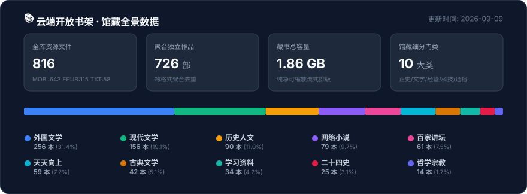
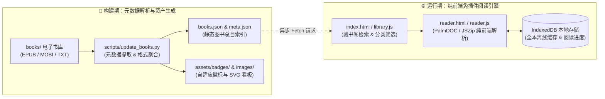
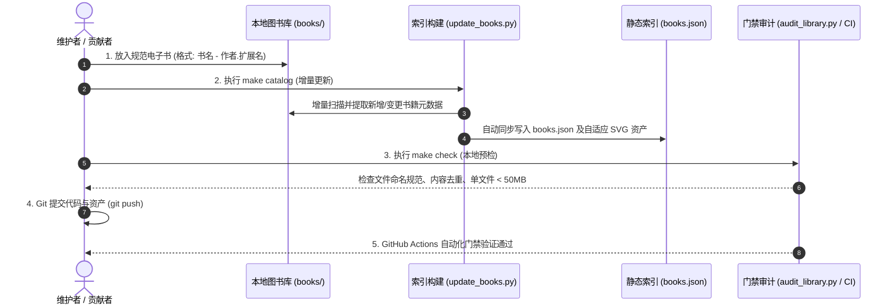

<div align="center">

# 📚 云端开放书架 (Open Cloud Bookshelf)

### 原 Kindle 藏书阁 · 经典免费电子书典藏库 · 纯静态免插件在线阅读器 · 独立离线书房

<p align="center">
  精心整理的经典中文与世界名著免费数字典藏 · 100% 纯净重排格式 · 剔除一切扫描件与杂质文件
</p>

[](https://zhipingyang.github.io/open-cloud-bookshelf/)
[](https://zhipingyang.github.io/open-cloud-bookshelf/)
[](https://zhipingyang.github.io/open-cloud-bookshelf/)
[](https://zhipingyang.github.io/open-cloud-bookshelf/)
[](https://zhipingyang.github.io/open-cloud-bookshelf/)
[](https://zhipingyang.github.io/open-cloud-bookshelf/)
[](https://zhipingyang.github.io/open-cloud-bookshelf/)
[](https://zhipingyang.github.io/open-cloud-bookshelf/)

<p align="center">
  <a href="https://zhipingyang.github.io/open-cloud-bookshelf/">
    
  </a>
  &nbsp;&nbsp;
  <a href="https://zhipingyang.github.io/open-cloud-bookshelf/bookshelf.html">
    
  </a>
  &nbsp;&nbsp;
  <a href="CATALOG.md">
    
  </a>
</p>

</div>

---

## ✨ 核心特性

- **📖 纯前端免插件阅读**：纯原生 JS 实时解码 MOBI（PalmDOC LZ77 流式解压）、EPUB（JSZip 重构）与 TXT，零后端依赖，支持链接直达指定章节。
- **💾 离线书房与断点续读**：依托 IndexedDB 实现全本离线存储与阅读进度毫秒级记忆，断网即开即读，支持本地电子书拖拽导入。
- **📱 移动端沉浸交互体验**：适配移动端视口（`100dvh`）与触控滑动手势，阅读时智能自动隐藏浮动栏，内置 4 套国风护眼排版主题。
- **📚 100% 纯净流式重排典藏**：全流式可调字号排版，彻底剔除扫描版及杂质附件，由自动化脚本与 CI 进行命名及数据规范化审计。

---

## 🗂 馆藏门类分布统计

<p align="center">
  
</p>

> [!NOTE]
> 馆藏最新实时规模与分布数据由自动化构建流水线统一绘制（详见上方全景数据看板）。各分类门类核心定位与代表名篇如下：

| 分类门类 | 格式支持 | 核心收录题材与代表作品 / 著者 |
| :--- | :---: | :--- |
| **外国文学** | MOBI / EPUB / TXT | 东野圭吾全集（含《白夜行》《无名之町》）、阿加莎·克里斯蒂探案集、《巨人的陨落》、《你当像鸟飞往你的山》、《百年孤独》、《追风筝的人》、《挪威的森林》、《全员嫌疑人》、《字母表谜案》等 |
| **现代文学** | MOBI / EPUB / TXT | 亦舒文集（80余部）、金庸武侠全集、古龙作品集、梁羽生系列、马伯庸《长安十二时辰》《风起陇西》、紫金陈《高智商犯罪》、周浩晖《暗黑者》《斗宴》、陈浩基《网内人》、小桥老树、常书欣等 |
| **历史人文** | MOBI / EPUB / TXT | 《美国陷阱》、《下流社会》、《一往无前》、《万历十五年》、《中国大历史》、《中国历史通俗演义》、《剑桥中国史》全系列、历史通识与名家传记 |
| **网络小说** | MOBI / EPUB / TXT | 《庆余年》、《牧神记》、《仙逆》、《雪中悍刀行》、《诡秘之主》、《择天记》、《莽荒纪》、《万相之王》、《灵境行者》、《深空彼岸》、《黄昏分界》、《全职高手》、《魔道祖师》、《赤心巡天》、《斩神》等 |
| **天天向上** | MOBI / EPUB / TXT | 《贫穷的本质》、《拖延心理学》、《了不起的我》、《微习惯》、《跃迁》、《早起的奇迹》、《金字塔原理》、《把时间当朋友》、《天才在左疯子在右》、《那些古怪又让人忧心的问题》等 |
| **百家讲坛** | MOBI / EPUB | 易中天品三国/先秦诸子、阎崇年清十二帝、刘心武谈红楼、金正昆谈礼仪、王立群读史记等名家演讲实录 |
| **古典文学** | MOBI / EPUB | 《四大名著》、《全宋词》、《唐诗三百首》、《乐府诗集》、《四书五经》、《资治通鉴》（文白对照与柏杨版）等 |
| **学习资料** | MOBI / EPUB | 《流畅的Python》、《学习的方法》、《我在100天内自学英文翻转人生》、《营销管理》、《定位》、英语词汇速记与常用参考手册 |
| **二十四史** | MOBI / EPUB | 司马迁《史记》、班固《汉书》至张廷玉《明史》全 24 部纪传体正史典籍 + 二十四史全集 EPUB 精装版 |
| **哲学宗教** | MOBI | 《中国哲学简史》、《西方哲学史》、《道德经》、《庄子》、《南怀瑾系列讲座》等 |

---

## 📱 阅读器与电子书设备导入指南

<details>
<summary><b>👉 点击展开：Kindle / 手机 / 微信读书导入指南</b></summary>

<br>

### 1. USB 数据线直传（推荐 Kindle 用户传输 MOBI）
1. 使用 USB 数据线连接 Kindle 与电脑；
2. 打开电脑识别出的 Kindle 驱动器，进入 **`documents`** 文件夹；
3. 将下载好的 `.mobi` 电子书复制进去，安全弹出设备后即可在 Kindle 书库即刻阅读。

### 2. 亚马逊官方 Send to Kindle（推荐 EPUB / MOBI 跨端同步）
- **网页版推送**：访问 [Amazon Send to Kindle 网页版](https://www.amazon.com/sendtokindle)（支持最大 200MB 文件），拖入书籍即可云端自动推送到绑定账号的所有 Kindle 设备与手机 App。
- **邮箱推送**：将电子书作为附件发送至您个人的 `@kindle.com` 专用邮箱。

### 3. 手机阅读 App（微信读书 / Apple Books / 多看阅读）
- 下载 `.epub` 或 `.mobi` 文件后，直接通过手机“分享”或“用其他应用打开”选择 **微信读书**、**Apple Books** 或 **多看阅读**，自动导入并享受高品质云端书架与排版。

</details>

---

## 🏛 系统架构与数据流向

项目采用**构建期静态清单生成**与**运行期客户端免插件渲染**的双层架构，零后端服务依赖：



---

## 🛠 本地开发与维护

本项目为纯静态架构，零构建打包成本，开箱即用：

```bash
# 1. 克隆代码仓库
git clone https://github.com/ZhipingYang/open-cloud-bookshelf.git
cd open-cloud-bookshelf

# 2. 本地启动 HTTP 服务预览
python3 -m http.server 8000
# 浏览器打开 http://localhost:8000 即可使用完整阅读器和书房

# 3. 增删书籍后自动化刷新索引
make catalog

# 4. 提交前进行自动化审计校验 (命名规范、单文件50MB限制、格式完整性)
make check
```

### 🔄 书籍新增与 CI 自动化流水线



> [!TIP]
> 详细维护规约参见 [书籍新增与网站更新流程](docs/MAINTENANCE.md)；仓库拆分与 CDN 静态资源治理方案参见 [仓库与书籍资源治理方案](docs/REPOSITORY_STRATEGY.md)。

---

## 📄 免责声明

本仓库所有图书资源均由网络公开渠道收集整理，仅供个人技术研究、数据检索测试及 Kindle 阅读排版体验交流使用。版权归原作者及出版机构所有，请在下载后 24 小时内删除。若有侵权争议，请提交 Issue 联系维护者清理。
